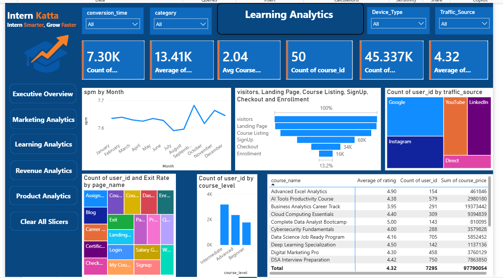
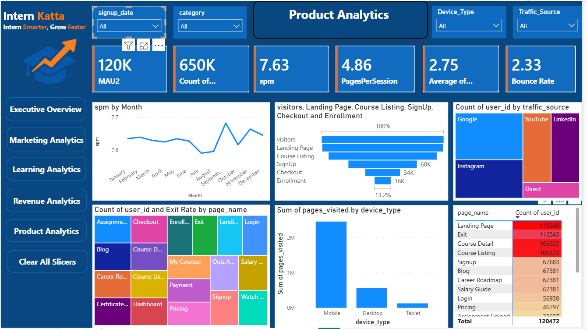

# Intern Katta — Product & Learning Analytics Dashboard (Power BI)

**Tools:** Power BI, DAX, Data Modeling, Multi-page Dashboard Design
**Dataset:** Synthetic dataset (built for internship training purposes, no real company data)

### Problem
An online learning platform ("Intern Katta") needs to answer two connected questions: **where are visitors dropping off** on their way to enrolling in a course, and **which courses are actually performing** once users are learning. Without a unified view, marketing can't tell if underperformance is a traffic problem, product can't tell if it's a UX problem, and the business can't tell which courses are worth doubling down on.

### Approach
Built a multi-page Power BI dashboard with two connected views, both filterable by Device Type, Traffic Source, Category, and date (signup date / conversion time):

**Product Analytics**
- KPI cards for MAU (120K), total page-visit count (650K), sessions-per-month (spm: 7.63), Pages per Session (4.86), and Bounce Rate (2.33)
- A funnel chart tracking the full journey — **Visitors → Landing Page → Course Listing → SignUp → Checkout → Enrollment** — showing volume and conversion % at each stage
- A traffic-source breakdown (Google, YouTube, LinkedIn, Instagram, Direct) sized by user count
- Exit-rate analysis by page name, to flag where users are dropping off within the site
- A device-type breakdown of total pages visited (Mobile, Desktop, Tablet)

**Learning Analytics**
- KPI cards for course engagement (7.30K, 13.41K avg, 2.04 avg course metric, 4.32 avg rating) and course count (50 courses)
- The same spm-by-month trend and traffic-source/funnel views, filtered to the learning context
- A course-level performance table showing **average rating, enrolled user count, and total revenue per course**
- A breakdown of users by course level (Beginner, Intermediate, Advanced)

Used DAX to calculate the stage-by-stage funnel conversion rate, average pages per session, and bounce rate as measures, and structured a shared data model so both pages stay in sync when filtered by any slicer.

### Key Metrics Surfaced
- **Monthly Active Users:** 120K+
- **Funnel conversion (Visitors → Enrollment):** 13.2%
- **Total course catalog:** 50 courses, average rating 4.32
- **Total course revenue tracked:** ₹97.79M across 7,295 enrolled users
- **Top-rated course:** Complete Data Analyst Bootcamp (5.00 rating)
- **Highest-revenue course:** Business Analytics Career Track (₹19.37M)
- **Device split:** Mobile drove roughly 3x the page visits of Desktop, with Tablet a distant third

### Insight & Impact
The funnel view made it possible to see exactly where the biggest drop-off happens — the steepest fall was between Course Listing and SignUp, which points to a conversion problem at the moment users are deciding to commit, not at the top of the funnel. Cross-referencing this with traffic source showed Google-driven traffic dominated user volume, so a targeted fix at the SignUp step would have outsized impact. On the learning side, the course table revealed that rating and revenue don't always move together — the highest-rated course wasn't the highest earner, which is exactly the kind of insight that helps a business decide whether to optimize for satisfaction, volume, or price per course.

### What I'd Do Next
Add a cohort view linking traffic source to course-level outcomes — e.g., do users acquired via YouTube enroll in different course categories or complete at different rates than those from Google — to connect acquisition strategy directly to learning outcomes rather than treating the two dashboards as separate stories.

---

## How to Use This
- Publish this file as a GitHub repo README (e.g. `intern-katta-analytics-dashboard`)
- Add both dashboard screenshots into a `screenshots` folder before publishing
- Post a shortened version (funnel insight + 1 screenshot) as a LinkedIn post, linking back to the full GitHub write-up
- Link it from your resume next to the Fourise internship bullet or as a second linked project
